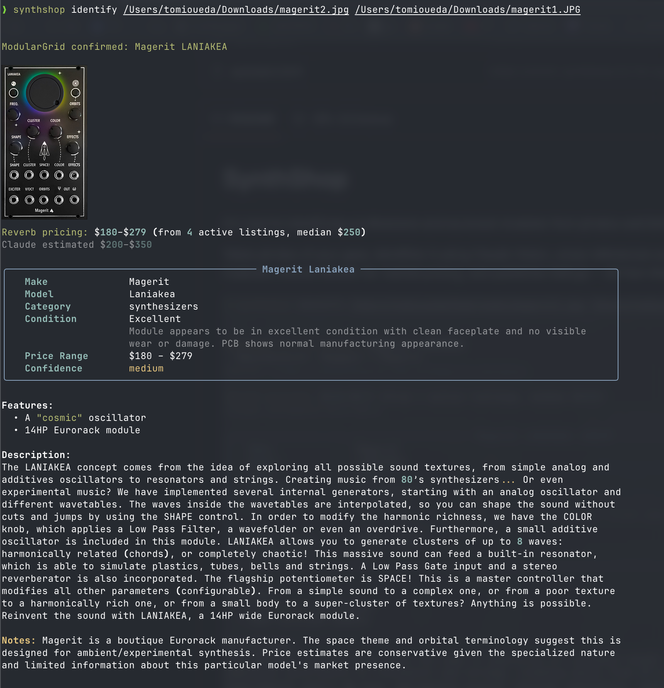

# SynthShop

CLI tool for identifying synthesizers and eurorack modules from photos and listing them on Reverb.

Takes photos of your gear, identifies it using Claude Vision, cross-references with ModularGrid for eurorack modules, detects custom panels, checks Reverb for market pricing, and publishes listings — all from the command line.



## Features

- **Photo identification** — Claude Vision identifies make, model, year, variant, condition, and generates listing descriptions with 4-8 key selling points
- **ModularGrid verification** — Corrects misidentified eurorack manufacturers and pulls accurate specs, descriptions, and features from ModularGrid (searches across 50+ manufacturers with parallel batch lookups)
- **Custom panel detection** — Compares user photos to stock ModularGrid panel images using a second Claude Vision call to detect aftermarket/custom faceplates
- **Reverb pricing** — Looks up active Reverb listings to replace Claude's estimated prices with real market data (low, high, median)
- **Inline terminal images** — Renders ModularGrid stock panel images directly in the terminal using the Kitty graphics protocol (Ghostty, Kitty, WezTerm)
- **One-command publishing** — Identify, upload images, and create a Reverb listing (draft or live) in a single step
- **Product tracking** — Track inventory through draft → listed → sold/unlisted states with local JSON storage

## Setup

Requires Python 3.11+.

```bash
python -m venv .venv
source .venv/bin/activate
pip install -e ".[dev]"
```

Copy `.env.example` to `.env` and add your API keys:

```bash
cp .env.example .env
```

Required keys:
- `ANTHROPIC_API_KEY` — from [console.anthropic.com](https://console.anthropic.com)
- `REVERB_API_TOKEN` — from Reverb > Settings > API & Integrations

Optional keys (for future features):
- `STRIPE_SECRET_KEY` / `STRIPE_PUBLISHABLE_KEY` — for direct payment links
- `R2_ACCOUNT_ID` / `R2_ACCESS_KEY_ID` / `R2_SECRET_ACCESS_KEY` — Cloudflare R2 image hosting

## Usage

### Identify a synth from photos

```bash
synthshop identify photo1.jpg photo2.jpg
```

This runs a multi-step pipeline:
1. **Claude Vision** analyzes the photos and returns a structured identification
2. **ModularGrid** (for eurorack modules) verifies the manufacturer/model and enriches with accurate specs
3. **Custom panel detection** compares your photos to the stock panel image
4. **Reverb pricing** replaces Claude's estimate with real market data from active listings

Options:
- `--model`, `-m` — Claude model to use (default: `claude-sonnet-4-20250514`)
- `--no-modulargrid` — Skip ModularGrid verification

### Publish a listing to Reverb

```bash
synthshop publish photos/*.jpg --price 250
```

Options:
- `--price`, `-p` — Listing price in USD (required)
- `--make` / `--model` — Skip photo identification, specify manually
- `--condition`, `-c` — Override condition (Mint, Excellent, Very Good, Good, Fair, Poor)
- `--shipping`, `-s` — Shipping price in USD (default: 0)
- `--live` — Publish immediately instead of creating a draft
- `--skip-reverb` — Save product locally without creating a Reverb listing

### List products

```bash
synthshop list
synthshop list --status sold
```

### Mark as sold or unpublish

```bash
synthshop sold <product-id>
synthshop unpublish <product-id>
```

## How It Works

### Identification Pipeline

```
Photos ──→ Claude Vision ──→ ModularGrid ──→ Panel Detection ──→ Reverb Pricing ──→ Result
             (identify)       (verify/correct)   (custom panel?)     (market data)
```

**Claude Vision** uses tool calling to return structured JSON with make, model, year, variant, category, description, features, condition, price range, and confidence level. The system prompt includes eurorack-specific guidance (logo identification, boutique manufacturer awareness).

**ModularGrid verification** uses a 4-tier search strategy:
1. Direct URL lookup (`modulargrid.net/e/{make}-{model}`)
2. DuckDuckGo search with smart slug ranking (prefers make+model matches)
3. DuckDuckGo with combined make+model query
4. Parallel brute-force across 50+ common manufacturer slugs

**Custom panel detection** downloads the stock panel image from ModularGrid and sends it alongside user photos to Claude Vision for comparison. If the panel differs from stock, the result is flagged as "Custom/aftermarket panel" — no specific maker is attributed since custom panels are often one-offs.

**Reverb pricing** searches active Reverb listings and extracts low, high, and median prices to replace Claude's estimate with real market data.

### Publish Pipeline

```
Photos ──→ Identify ──→ Confirm ──→ Create Reverb Listing ──→ Upload Images ──→ Save JSON
                          (y/n)        (draft or live)
```

Products are stored as JSON files in `products/` and cycle through statuses: `draft` → `listed` → `sold` or `unlisted`.

## Project Structure

```
src/synthshop/
├── cli/
│   ├── main.py              Typer app entry point (5 commands)
│   ├── prompts.py            Claude Vision prompt templates
│   └── commands/
│       ├── identify.py       Photo → identification pipeline
│       ├── publish.py        Full listing workflow
│       ├── list.py           List products with status
│       └── unpublish.py      Sold/unpublish commands
├── core/
│   ├── models.py             Product, Condition, ProductStatus, ReverbListing
│   ├── config.py             Settings from .env (Pydantic)
│   └── product_store.py      JSON file CRUD for products
└── integrations/
    ├── claude_vision.py      Claude Vision API (identify + panel detect)
    ├── modulargrid.py        ModularGrid search and HTML parsing
    └── reverb.py             Reverb API client (HAL+JSON, rate limiting)

tests/                        148 tests with mocked external APIs
products/                     Product JSON files (the "database")
```

## Integrations

### Claude Vision (`claude_vision.py`)
- Multimodal image analysis (JPEG, PNG, GIF, WebP)
- Automatic image resizing for API limits (3.75MB raw / 5MB base64)
- Structured output via tool calling (`identify_synth`, `detect_custom_panel`)
- Configurable model (defaults to Claude Sonnet 4)

### ModularGrid (`modulargrid.py`)
- 4-tier search: direct URL → DuckDuckGo → DuckDuckGo with make → brute-force
- Smart slug ranking to avoid wrong-module matches on ambiguous names
- Async parallel HEAD requests (batches of 10) for manufacturer brute-force
- HTML parsing for specs, descriptions, features, images, discontinued status
- 50+ common eurorack manufacturers in the search list

### Reverb API (`reverb.py`)
- HAL+JSON API client with bearer token auth
- Create/update/publish/end listings
- Image upload (multipart form)
- Price guide lookup (low, high, median from active listings)
- Categories and conditions reference data (with local caching)
- Rate limiting with exponential backoff on 429 responses

## Tests

All external APIs (Anthropic, Reverb, ModularGrid, DuckDuckGo) are mocked — no API keys needed to run tests.

```bash
pytest                    # Run all 148 tests
pytest -v                 # Verbose output
pytest -k "modulargrid"   # Match keyword
pytest --cov=synthshop    # With coverage
```

### Test breakdown

| File | Tests | Covers |
|------|------:|--------|
| `test_reverb.py` | 32 | API client, rate limiting, listing CRUD, image upload, caching |
| `test_modulargrid.py` | 30 | HTML parsing, slug search/ranking, batch lookup, DDG search |
| `test_identify_modulargrid.py` | 21 | ModularGrid correction of make/model/description/features |
| `test_cli.py` | 15 | All CLI commands (identify, publish, list, unpublish, sold) |
| `test_claude_vision.py` | 13 | Image encoding, content blocks, tool use, panel detection |
| `test_product_store.py` | 12 | JSON CRUD, listing, sorting, deletion |
| `test_models.py` | 11 | Pydantic models, enums, serialization |
| `test_config.py` | 7 | Settings loading, API key validation |
| `test_custom_panel.py` | 7 | Custom panel detection, stock panel handling, error resilience |
| **Total** | **148** | |

## Linting

```bash
pylint src/synthshop/     # Currently 10.00/10
```

## Configuration

All settings are loaded from environment variables or `.env`:

| Variable | Required | Description |
|----------|----------|-------------|
| `ANTHROPIC_API_KEY` | Yes | Claude Vision identification |
| `REVERB_API_TOKEN` | Yes | Reverb listing management |
| `REVERB_BASE_URL` | No | API base URL (default: `https://api.reverb.com/api`, use `https://sandbox.reverb.com` for testing) |
| `PRODUCTS_DIR` | No | Product JSON storage path (default: `products/`) |
| `STRIPE_SECRET_KEY` | No | Stripe payments (future) |
| `R2_ACCOUNT_ID` | No | Cloudflare R2 image hosting (future) |
| `SHOP_BASE_URL` | No | Direct shop URL (default: `https://shop.bounceconnectionrecords.com`) |

## Roadmap

- [ ] Cloudflare R2 image hosting
- [ ] Stripe Payment Links for direct sales
- [ ] Shop website (FastAPI + Jinja2) at `shop.bounceconnectionrecords.com`
- [ ] `synthshop sync` to poll Reverb for sold items
- [ ] eBay integration
